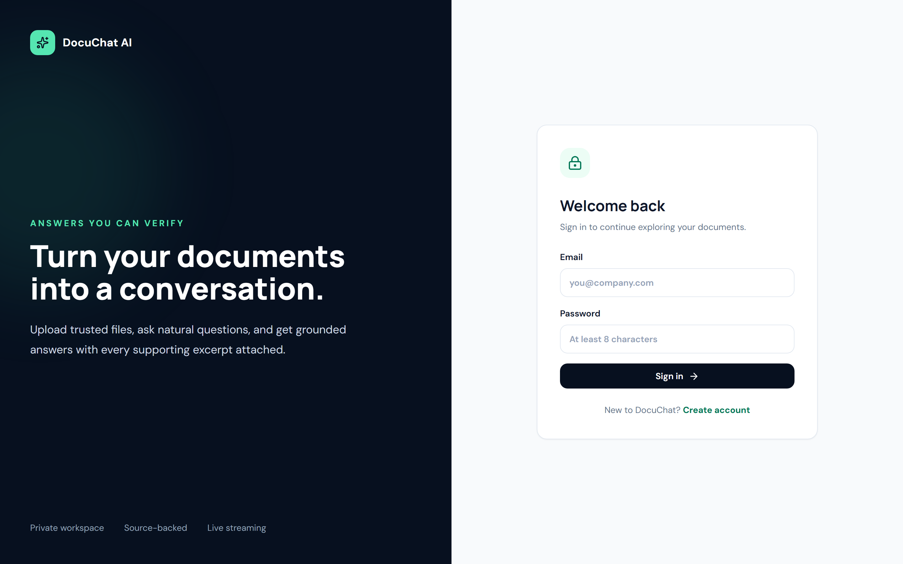
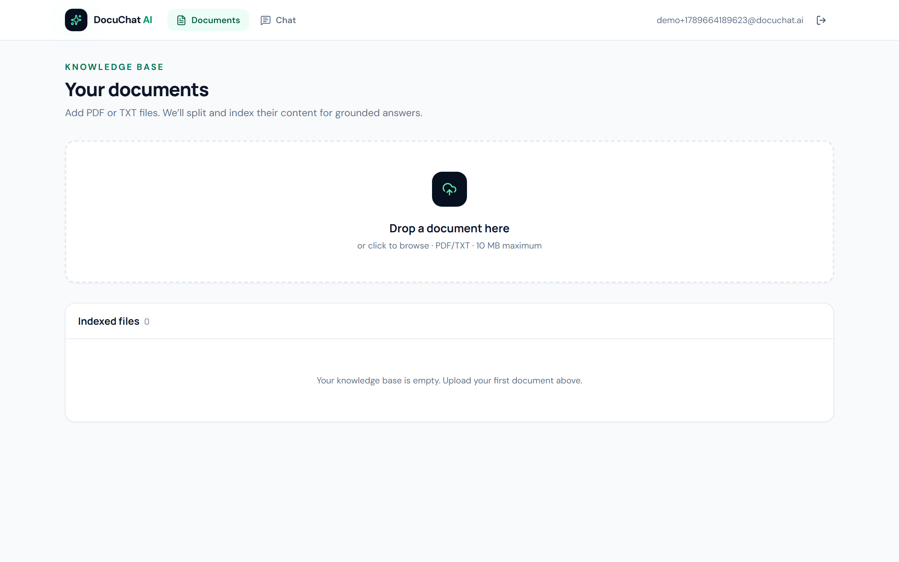
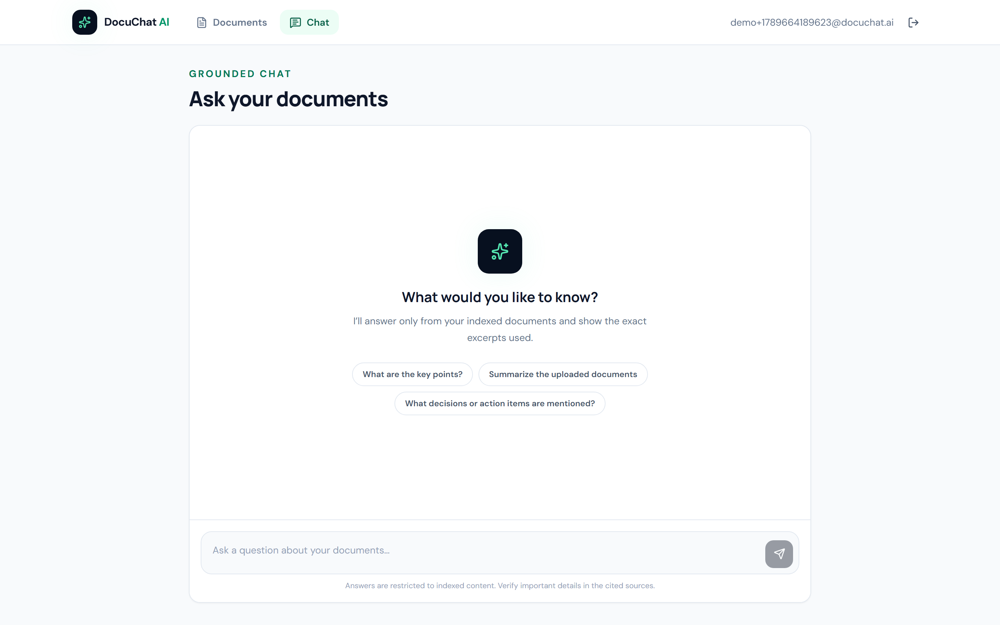
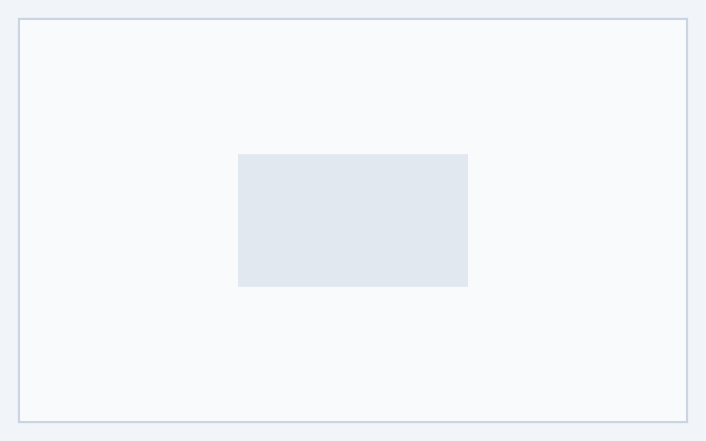
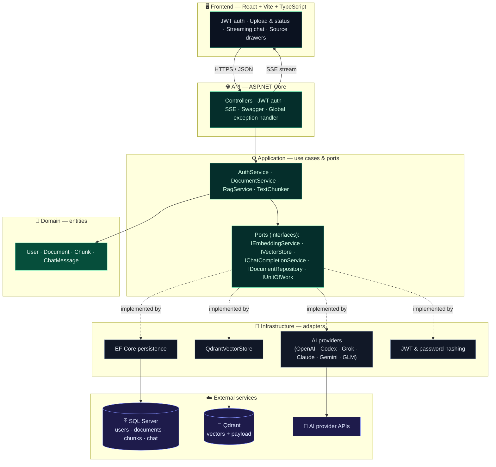
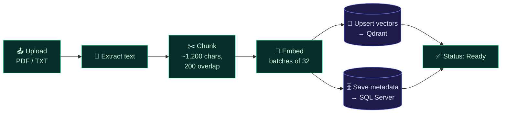
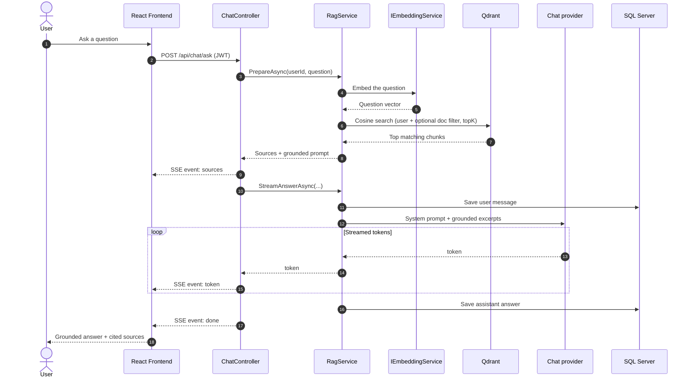

<div align="center">

# 📄 DocuChat AI

**Chat with your documents — and verify every answer against its source.**

A production-minded **RAG** (Retrieval-Augmented Generation) application for asking natural-language
questions of your PDF and TXT files. Built on a **.NET 8 clean-architecture** API, **Qdrant** vector
search, **SQL Server** for relational data, and a responsive **React + TypeScript** frontend.
Answers **stream** to the browser and arrive with the exact source excerpts they were grounded on.

<br/>

`.NET 8` · `Clean Architecture` · `SQL Server` · `Qdrant` · `React + Vite` · `Server-Sent Events` · `Multi-provider AI`

</div>

---

## ✨ Highlights

- **Grounded answers only.** The model is instructed to answer *only* from retrieved excerpts and to
  refuse gracefully when the documents don't cover the question.
- **Every answer is traceable.** Source excerpts (file, chunk, similarity score) stream to the UI
  before the answer tokens do.
- **Swap AI providers by config.** OpenAI, Codex, xAI Grok, Anthropic Claude, Google Gemini, and Zhipu
  GLM for chat; OpenAI and Gemini for embeddings — chosen independently.
- **Real streaming UX.** Server-Sent Events push `sources → token → done` for a live, typewriter feel.
- **Multi-tenant isolation.** Every vector query and document operation is filtered by the owning user.
- **Clean architecture, enforced by tests.** The dependency boundary and the one-type-per-file
  convention are verified by an architecture test suite.

---

## 🖼️ Screenshots

<div align="center">

**Sign in — a private, source-backed workspace**



</div>

| Knowledge base | Grounded chat |
|:---:|:---:|
|  |  |
| Upload PDF/TXT files; each is chunked and indexed. | Ask questions and get answers grounded in your files. |

| Indexed document *(placeholder)* | Streamed answer with sources *(placeholder)* |
|:---:|:---:|
|  |  |
| 🔜 A file at **Ready** status after indexing. | 🔜 A grounded answer with its cited source excerpts. |

> **Note:** the last two images are placeholders. Capture the real views once an embedding **and** a
> chat provider key are configured (see [Configure & run](#-configure--run)), then overwrite
> `docs/screenshots/upload.png` and `docs/screenshots/answer.png` — no README changes needed.

---

## 🏗️ Architecture

DocuChat AI follows **clean architecture**: the dependency arrows point *inward*, so business rules
never depend on frameworks, databases, or vendor SDKs.



The dependency direction is **`API → Application ← Infrastructure`**, with **Domain** at the center.
The **Application** layer owns the authentication, document-indexing, and RAG use cases and has *no*
dependency on ASP.NET Core, EF Core, Qdrant, or any vendor SDK. **Infrastructure** implements the
ports that Application defines.

Three AI/data concerns are deliberately separated behind ports:

| Port | Responsibility | Current implementation |
|---|---|---|
| `IEmbeddingService` | Turns text into vectors | Selects the configured embedding provider |
| `IVectorStore` | Persists & queries vectors | `QdrantVectorStore` |
| `IChatCompletionService` | Streams generated text | Selects a named `IChatModelProvider` |

Chat and embedding providers are selected **independently**, because not every chat vendor offers
embeddings. Every C# class, interface, record, and enum lives in its own file — a convention the
architecture test suite enforces alongside the Application-layer dependency boundary.

---

## 🔄 How RAG works here

### 1) Indexing — turning a document into searchable vectors



Text is normalized and split into ~1,200-character chunks with 200 characters of overlap, respecting
sentence boundaries. Chunks are embedded in batches, vectors and their source payloads are upserted
into **Qdrant**, and **SQL Server** keeps the relational ownership, status, and chat records — *not*
the vectors. If any step fails, the document is marked `Failed`, its error is recorded, and any
partial vectors are rolled back.

### 2) Retrieval & generation — answering a question



The system prompt instructs the model to answer **only** from the supplied excerpts and to reply
*"I couldn't find that in the uploaded documents."* when they don't cover the question — so an
out-of-scope question yields a grounded refusal rather than a hallucination.

---

## 📁 Repository layout

```text
backend/src/DocuChat.Api                          HTTP, JWT, Swagger, SSE, error handling
backend/src/DocuChat.Application                  use cases, DTOs, and outbound ports
backend/src/DocuChat.Domain                       User, Document, Chunk, ChatMessage
backend/src/DocuChat.Infrastructure/AI            chat & embedding providers
backend/src/DocuChat.Infrastructure/Vector        Qdrant implementation
backend/src/DocuChat.Infrastructure/Persistence   EF Core repository adapters (SQL Server)
backend/src/DocuChat.Infrastructure/Security      JWT & password adapters
backend/tests/DocuChat.Tests                      unit & Qdrant integration tests
frontend                                          React, TypeScript, Tailwind
docker-compose.yml                                local Qdrant service
docs/screenshots                                  UI screenshots used in this README
samples                                           a document to try
```

---

## 🧩 Supported AI providers

| Configuration name | API style | Chat | Embeddings |
|---|---|:---:|:---:|
| `OpenAI` | Chat Completions / Embeddings | ✅ | ✅ |
| `Codex` | OpenAI Responses | ✅ | ❌ — use OpenAI or Gemini |
| `Grok` | xAI (OpenAI-compatible) | ✅ | ❌ |
| `Claude` | Anthropic Messages | ✅ | ❌ |
| `Gemini` | Google `streamGenerateContent` / `batchEmbedContents` | ✅ | ✅ |
| `GLM` | Zhipu (OpenAI-compatible) | ✅ | ❌ |

The model IDs in `appsettings.json` are examples and stay fully configurable; availability depends on
your vendor account. When the embedding model or its output dimension changes, use a **new Qdrant
collection name** and re-upload documents.

---

## ✅ Prerequisites

- **.NET 8 SDK** or newer
- **Node.js 20+**
- **SQL Server** — a reachable instance (SQL Server **Express**, LocalDB, a full instance, or the `mcr.microsoft.com/mssql/server` container)
- **Docker Desktop** or another reachable **Qdrant** instance
- An **API key** for the selected chat provider **and** for the selected embedding provider

> **Windows note:** if `dotnet --version` produces no output because a zero-byte
> `C:\Windows\System32\dotnet` shim takes precedence, invoke `C:\Program Files\dotnet\dotnet.exe`
> explicitly or fix the `PATH` order.

---

## 🚀 Configure & run

### 1. Start Qdrant

```powershell
docker compose up -d qdrant
```

### 2. Point the API at SQL Server

Set the relational connection string in `ConnectionStrings:DefaultConnection`. It already ships with a
local **SQL Server Express** value in `appsettings.json`; swap in your own server/credentials:

```json
"ConnectionStrings": {
  "DefaultConnection": "Server=localhost\\SQLEXPRESS;Database=DocuChatAI;Trusted_Connection=True;TrustServerCertificate=True;"
}
```

Common alternatives — LocalDB: `Server=(localdb)\MSSQLLocalDB;Database=DocuChatAI;Trusted_Connection=True;TrustServerCertificate=True`;
SQL auth: `Server=localhost,1433;Database=DocuChatAI;User Id=sa;Password=...;TrustServerCertificate=True`.
To keep it out of source control, set it with user-secrets instead:

```powershell
dotnet user-secrets set "ConnectionStrings:DefaultConnection" "<your-connection-string>" --project backend/src/DocuChat.Api
```

The API creates the database and applies EF migrations automatically on startup.

### 3. Choose AI providers

In `backend/src/DocuChat.Api/appsettings.json`:

```json
"AI": {
  "ChatProvider": "Claude",
  "EmbeddingProvider": "OpenAI"
}
```

Valid chat values: `OpenAI`, `Codex`, `Grok`, `Claude`, `Gemini`, `GLM`.
Valid embedding values: `OpenAI`, `Gemini`.

### 4. Store secrets (never commit real keys)

```powershell
dotnet user-secrets set "Jwt:Key" "replace-with-a-random-secret-of-at-least-32-characters" --project backend/src/DocuChat.Api
dotnet user-secrets set "AI:Providers:OpenAI:ApiKey" "sk-..." --project backend/src/DocuChat.Api
dotnet user-secrets set "AI:Providers:Claude:ApiKey" "..."    --project backend/src/DocuChat.Api
dotnet user-secrets set "AI:Providers:Gemini:ApiKey" "..."    --project backend/src/DocuChat.Api
```

The same hierarchy works with environment variables — e.g. `AI__ChatProvider=Grok` and
`AI__Providers__Grok__ApiKey=...`. Qdrant Cloud is configured with `VectorStore__BaseUrl` and
`VectorStore__ApiKey`. **Never** put real keys in source or in frontend environment files.

### 5. Run the API (EF migrations apply automatically)

```powershell
dotnet restore DocuChatAI.slnx --configfile NuGet.Config
dotnet run --project backend/src/DocuChat.Api --launch-profile http
```

- API → `http://localhost:5080`
- Swagger → `http://localhost:5080/swagger`

### 6. Run the frontend

```powershell
cd frontend
npm install
npm run dev
```

Open `http://localhost:5173`, register, and upload
[`samples/company-handbook.txt`](samples/company-handbook.txt). Try asking:

- How many paid leave days do employees receive?
- What can the learning allowance be used for?
- What should I do if I suspect a security incident?
- What is the parental leave policy? *(The correct result is a grounded refusal.)*

---

## 🔌 API reference

| Method | Route | Purpose |
|---|---|---|
| `POST` | `/api/auth/register` | Create an account and return a JWT |
| `POST` | `/api/auth/login` | Return a JWT |
| `GET` | `/api/documents` | List the current user's documents |
| `POST` | `/api/documents` | Extract, embed, and index a PDF/TXT file |
| `DELETE` | `/api/documents/{id}` | Delete relational chunks and Qdrant points |
| `POST` | `/api/chat/ask` | Stream `sources`, `token`, `done`, and `error` events |

---

## 🧪 Verification

```powershell
dotnet build DocuChatAI.slnx
dotnet test backend/tests/DocuChat.Tests

# Include the Qdrant integration test
$env:RUN_QDRANT_TESTS="1"
dotnet test backend/tests/DocuChat.Tests

cd frontend
npm run build
```

The Qdrant integration test creates a temporary collection, verifies tenant-filtered retrieval and
deletion, then removes the collection.

---

## 🛣️ Production hardening

This is a proof of concept. For production, consider:

- Moving indexing to a **durable queue** with retry / circuit-breaker policies and rate limits.
- Storing source files in **object storage**.
- **Pinning** container and model versions.
- Persisting richer **chat/source relationships** for historical replay.
